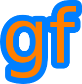

# Gamedev Framework (gf)

[](https://travis-ci.org/GamedevFramework/gf)
[](https://ci.appveyor.com/project/jube/gf)
[](https://raw.githubusercontent.com/GamedevFramework/gf/master/LICENSE)
[](https://github.com/GamedevFramework/gf/tags)

__Gamedev Framework (gf)__ is a framework to build 2D games in C++11. It is based on [SDL](https://www.libsdl.org/) and [OpenGL ES 2.0](https://www.khronos.org/opengles/2_X/), and presents an API that is very similar to the graphics module of [SFML](http://www.sfml-dev.org/) with additional features. It is _not_ a [game engine](https://en.wikipedia.org/wiki/Game_engine), it is more something like a framework, similar to [libGDX](https://libgdx.badlogicgames.com/) in the Java world.

Gamedev Framework (gf) is licensed under the terms and conditions of the [zlib/libpng license](https://opensource.org/licenses/Zlib).



## Quick example

```cpp
#include <gf/Event.h>
#include <gf/Font.h>
#include <gf/RenderWindow.h>
#include <gf/Sprite.h>
#include <gf/Text.h>
#include <gf/Window.h>

int main() {
  // Create the main window and the renderer
  gf::Window window("Example", { 640, 480 });
  gf::RenderWindow renderer(window);

  // Load a sprite to display

  gf::Texture texture;

  if (!texture.loadFromFile("sprite.png")) {
    return EXIT_FAILURE;
  }

  gf::Sprite sprite(texture);
  sprite.setPosition({ 300, 200 });

  // Create a graphical text to display

  gf::Font font;

  if (!font.loadFromFile("DroidSans.ttf")) {
    return EXIT_FAILURE;
  }

  gf::Text text("Hello gf!", font, 50);
  text.setPosition({ 100, 100 });

  renderer.clear(gf::Color::White);

  // Start the game loop

  while (window.isOpen()) {
    // Process events

    gf::Event event;

    while (window.pollEvent(event)) {
      switch (event.type) {
        case gf::EventType::Closed:
          window.close();
          break;
        default:
          break;
      }
    }

    // Draw the entities

    renderer.clear();
    renderer.draw(sprite);
    renderer.draw(text);
    renderer.display();
  }

  return 0;
}
```

## Documentation

See the [online documentation for Gamedev Framework (gf)](http://gamedevframework.github.io/).

## Contact

If you want to talk directly with the developpers, you can join the [#gf-devel IRC channel on Freenode](irc://chat.freenode.net/gf-devel). Or you can post a message on [/r/GamedevFramework](https://www.reddit.com/r/GamedevFramework/).

## Contribution

Gamedev Framework (gf) is very open to contributions. See [the contribution guidelines](CONTRIBUTING.md).

## Dependencies

You have to install the following dependencies:

- [SDL2](https://www.libsdl.org/) >= 2.0.2 (zlib/libpng license)
- [Boost Filesystem](http://www.boost.org/doc/libs/release/libs/filesystem/) >= 1.55 (Boost license)
- [Boost String Algorithms](http://www.boost.org/doc/libs/release/libs/algorithm/string/) >= 1.55 (Boost license)
- [Boost Heap](http://www.boost.org/doc/libs/release/libs/heap/) >= 1.55 (Boost license)
- [Freetype](http://freetype.org/) >= 2.5.2 (FreeType license)
- [zlib](https://zlib.net/) >= 1.2.8 (zlib/libpng license)
- [CMake](https://cmake.org/) >= 3.0.2

See the [documentation](http://gamedevframework.github.io/latest/build_and_install.html) for more information on how to build and install gf.
