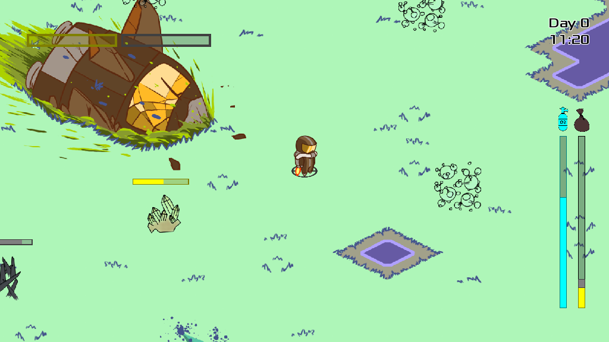

# Harvest Oxygen in the Maldoran Ecosystem (HOME)

You crash on a unexplored planet, called Maldoran, you have to harvest oxygen to survive, metal and energy to repair your ship to be able to go home finally.

## How to play

- Mouse: click to make the hero move
- F: Toggle fullscreen
- Escape: Stop the game

## Additional requirements

- SFML AUdio
- Box2D

## Screenshot

## Authors

The Hatunruna team:

- Arthur Hugeat, arthur dot hugeat at univ dash fcomte dot fr
- Benjamin Goodwin, benjamin dot d dot goodwin at gmail dot com
- Célia Dehors, celia dot dehors at gmail dot com
- Julien Bernard, julien dot bernard at univ dash fcomte dot fr
- Lilian Franchi, lilian dot franchi at edu dot univ dash fcomte dot fr
- Timothée Laurent

## Context

This game is an adaptation of a [game](https://globalgamejam.org/2019/games/harvest-oxygen-maldoran-ecosystem) that was released during the 2019 Global Game Jam.

## License

HOME is licensed under the terms and conditions of the [GPL 3.0](https://opensource.org/licenses/GPL-3.0) for the code and [CC BY-SA 4.0](https://creativecommons.org/licenses/by-sa/4.0/) for the data.
