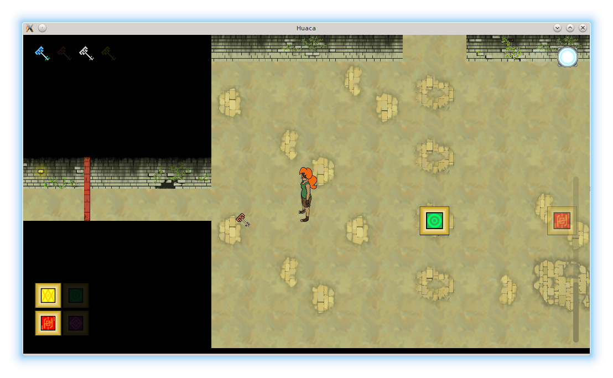

# Huaca

You have been trapped in an inca temple, you have to escape. Find the ritual and you will get to the next level.

A [Huaca](https://en.wikipedia.org/wiki/Huaca) (wak'a) is an object that represents something revered, typically a monument. Some of them have been associated with veneration and ritual.

## How to play

- Arrows: Move the character
- Space: Drop a portal
- F: Toggle fullscreen
- Escape: Stop the game

## Screenshot

## Authors

The Hatunruna team:

- Arthur Hugeat, arthur dot hugeat at univ dash fcomte dot fr
- Benjamin Goodwin, benjamin dot d dot goodwin at gmail dot com
- Célia Dehors, celia dot dehors at gmail dot com
- Julien Bernard, julien dot bernard at univ dash fcomte dot fr
- Roxanne Herbstmeyer
- Sophie Teixeira

## Context

This game is an adaptation of a [game](http://globalgamejam.org/2016/games/huaca) that was released during the 2016 Global Game Jam. The original game was made with SFML and custom classes that are now present in gf. The adaptation took two days.

## License

Huaca is licensed under the terms and conditions of the [GPL 3.0](https://opensource.org/licenses/GPL-3.0) for the code and [CC BY-SA 4.0](https://creativecommons.org/licenses/by-sa/4.0/) for the data.
