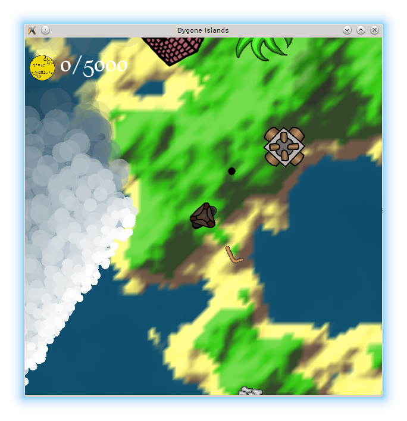

# Bygone Islands

Bygone Islands is a game set in a steampunk pirates world where you have to recover enough coins to be able to repay your debt. This won't be a calm journey, with ancient turrets trying to stop you, and dangerous waves.

## How to play

- Arrows: Move the character
- Space: Start the compass
- F: Toggle fullscreen
- Escape: Stop the game

## Screenshot

## Authors

The Hatunruna team:

- Arthur Hugeat, arthur dot hugeat at univ dash fcomte dot fr
- Benjamin Goodwin, benjamin dot d dot goodwin at gmail dot com
- Célia Dehors, celia dot dehors at gmail dot com
- Julien Bernard, julien dot bernard at univ dash fcomte dot fr
- Lilian Franchi, lilian dot franchi at edu dot univ dash fcomte dot fr
- Sophie Teixeira

## Context

This game is an adaptation of a [game](http://globalgamejam.org/2017/games/bygone-islands) that was released during the 2017 Global Game Jam.

## License

Bygone Islands is licensed under the terms and conditions of the [GPL 3.0](https://opensource.org/licenses/GPL-3.0) for the code and [CC BY-SA 4.0](https://creativecommons.org/licenses/by-sa/4.0/) for the data.
